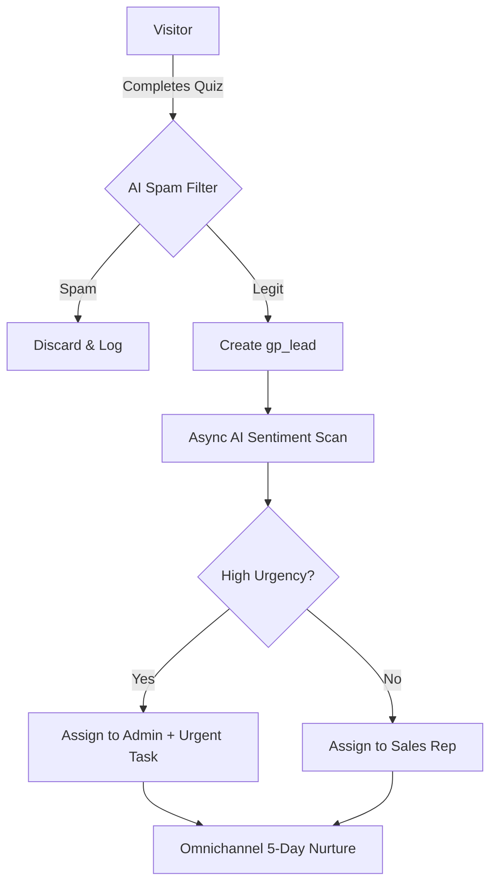
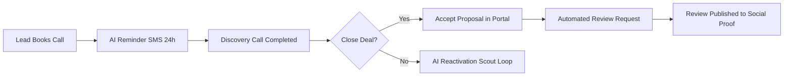

# GrowthPress: AI & Automation Visual Logic Diagrams

These diagrams provide a visual map of the autonomous loops within the GrowthPress OS.

## 1. The Intelligent Triage Loop


## 2. The Appointment & Retention Loop


## 3. The Content & SEO Loop
```mermaid
graph TD
    A[Market Topic] --> B[AI Content Studio]
    B --> C[Generate Authority Guide]
    C --> D[Publish to Knowledge Base]
    D --> E[SEO Traffic Capture]
    E --> F[Internal Hook to [gp_quiz_lead_form]]
    F --> G[New Intelligent Lead]
```
