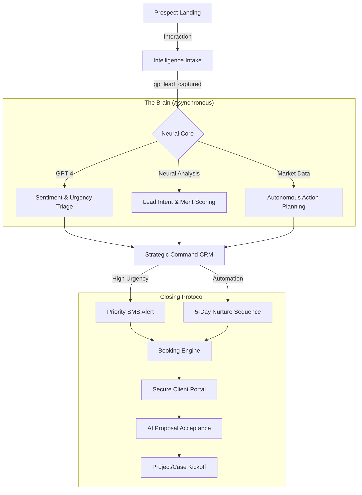

# GrowthPress v6.3: Technical Architecture & Omni-Intelligence Lead Flow

The GrowthPress OS operates on a "Hooks-First" asynchronous architecture designed for enterprise-grade scalability.

## 🔄 The Omni-Intelligence Lead Lifecycle

## 🔐 Security & Data Sovereignty
- **Encryption**: All client portal sessions use `AES-256-GCM` authenticated encryption.
- **Access Control**: Role-based capabilities combined with WP Nonce and Bearer Token verification for all REST endpoints.
- **Asynchronicity**: AI processing is offloaded to WP-Cron and background AJAX to ensure sub-1s frontend response times.

## 🛠️ Modular Niche Architecture
Each of the 10 industry modules follows a strict separation of concerns:
1.  **CPT Layer**: Specialized data structures (e.g., `gp_property` for Real Estate).
2.  **Tool Layer**: Interactive shortcodes (e.g., `gp_tax_estimator` for Accounting).
3.  **Intelligence Layer**: Custom AI prompts and triage logic calibrated for the specific industry.

---

*Status: Architecture Validated. v6.3 Definitive.*
