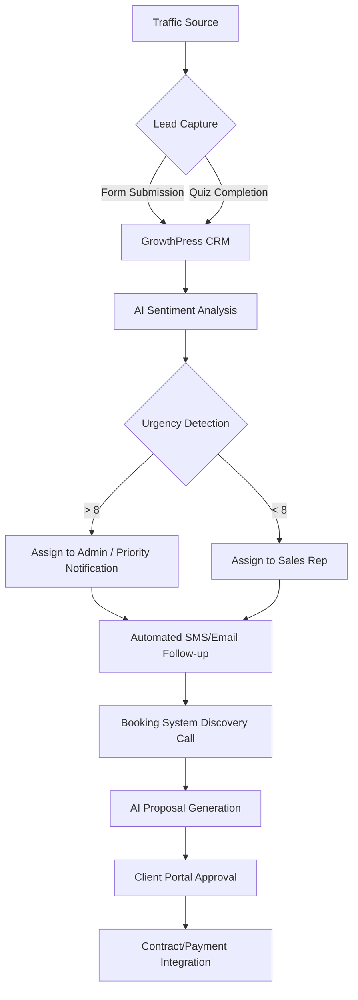

# GrowthPress CRM & Sales Architecture

## Lead Lifecycle Flow

## Database Schema (Modular Meta)

| Object | Meta Key | Purpose |
| :--- | :--- | :--- |
| **Lead (gp_lead)** | `_lead_score` | AI-calculated lead quality (0-100) |
| | `_lead_intent` | Identified intent (Residential, Commercial, Enterprise) |
| | `_sentiment` | JSON analysis from OpenAI |
| | `_behavior_log` | JSON array of pages visited and time on site |
| **Appointment (gp_appointment)** | `_appointment_date` | Date and time of scheduling |
| | `_staff_id` | Assigned professional ID |
| | `_telemedicine_link` | Auto-generated meeting URL |
| **Proposal (gp_proposal)** | `_related_lead` | ID of the lead this proposal belongs to |
| | `_proposal_status` | Draft, Sent, Accepted, Declined |
| | `_proposal_value` | Estimated contract value |

## AI Intelligence Workflows

### 1. Lead Qualification (The "Triage" Loop)
1. Lead submits a query.
2. `GrowthPress_CRM` triggers `gp_lead_captured`.
3. `GrowthPress_AI` analyzes the message for sentiment and high-ticket identifiers.
4. Lead is tagged and routed to the correct pipeline stage.
5. If medical/legal, niche-specific triage logic is applied.

### 2. Marketing Nurture Loop
1. Lead stage changes to "Follow-up".
2. System pulls `gp_lead_intent`.
3. AI generates a personalized 5-day nurture sequence based on that intent.
4. SMS/Email automation triggers via integrated APIs (Twilio/FluentCRM).
