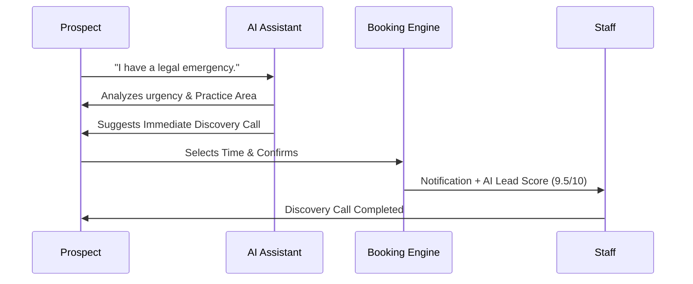
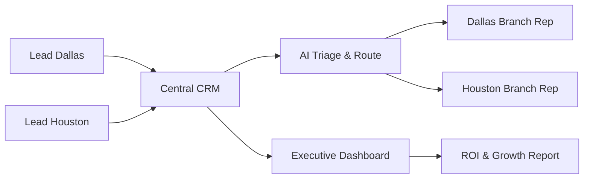

# GrowthPress Personas & User Flow Maps

## 1. The High-Ticket Prospect
**Goal:** Solve a pressing problem (Legal, Medical, Construction) with high-confidence professionals.

## 2. The Multi-Location Business Owner
**Goal:** Centralize lead flow and track team performance across branches.

## 3. The Agency / White-Label Admin
**Goal:** Deploy a premium OS for a client and manage their settings.

1. **Deployment:** Install Theme & Plugin.
2. **Setup:** Run Niche Setup Wizard (One-Click).
3. **Customization:** Set Brand Colors & Logo in Customizer.
4. **Activation:** Input OpenAI & Twilio Keys.
5. **Handover:** Client gets access to 'Shortcode Library' and 'Content Studio'.
